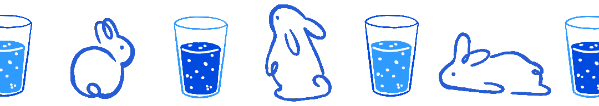

# 🐰 **HydraBun**

HydraBun es una aplicación cuyo objetivo es recordarte que debes beber agua todos los días, utilizando un simpático conejo que se encarga de recordarte tu meta diaria de hidratación.

## 📘 **Acerca de este proyecto**

Este proyecto fue iniciado durante mis estudios de DAM1 (Desarrollo de Aplicaciones Multiplataforma) como una forma de practicar lo que estábamos aprendiendo en ese momento.

## 🔧 **Funcionalidades futuras**

- **Historial de consumo de agua**: Pantalla para ver el seguimiento de tu consumo de agua desde que empezaste a usar la aplicación.
- **Personalización de los litros**: Permite definir la cantidad de agua del vaso para que la aplicación se ajuste a las necesidades diarias de cada usuario.
- **Notificaciones y recordatorios**: La aplicación enviará recordatorios a lo largo del día para animarte a beber agua.
- **Tienda de accesorios y mascotas**: Al completar tu objetivo diario de hidratación, recibirás monedas que podrás gastar en la tienda para personalizar a tu conejo, comprar diferentes mascotas y cambiar los fondos de la app.

## ⚙️ **Estado del proyecto**

Actualmente, la aplicación se encuentra en su fase inicial, con solo un par de pantallas y pocas funcionalidades implementadas.

El desarrollo de la app se pausó debido a la época de exámenes de DAM1 y, posteriormente, por tener otras ideas de proyectos en mente. Sin embargo, la idea de esta aplicación sigue siendo parte de mis planes y espero retomar su desarrollo en algún momento.

